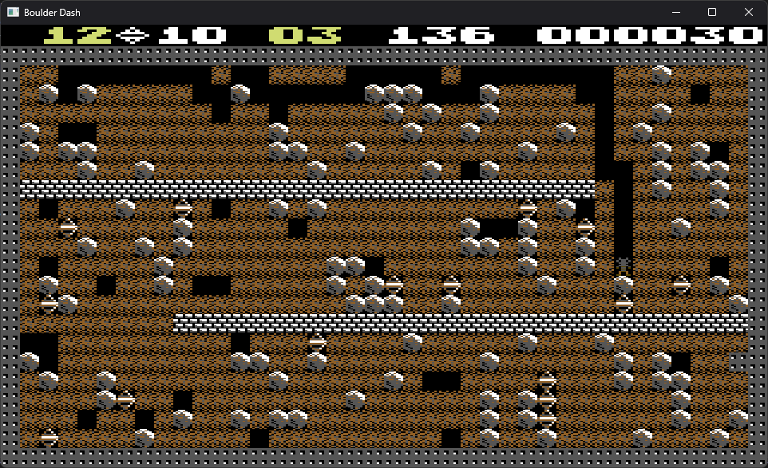

# Boulder Dash

An AI-made C++17 and Qt 6 port of the classic Commodore 64 game *Boulder Dash*,
tested on Windows and Linux.

<p align="center">
  
</p>

## Project status

This project is an unofficial, experimental, non-commercial port of the
Commodore 64 game *Boulder Dash*.

The game is implemented as a cross-platform C++ application using Qt. The same
codebase builds and runs on Windows and Linux.

**The graphics and audio assets required to run the application are not included in this repository for copyright reasons.**

The name *Boulder Dash*, the character Rockford, the original caves, graphics,
animations, sound effects, music, and other elements originating from the
original game may be protected by intellectual property rights held by their
respective owners. This project is not affiliated with or endorsed by those
owners.

This repository is published in good faith for technical study, documentation,
and preservation. Its non-commercial nature does not by itself grant permission
to use protected material. Anyone wishing to use, modify, or redistribute it is
responsible for determining which permissions are required.

The project is provided as is, without warranty. Its use is entirely at the user's own risk.

### **If any remaining material raises concerns for a rights holder, please [contact the maintainer](https://www.linkedin.com/in/tony-pourchier-b587b720/). The relevant elements will be promptly removed or changed.**

## Requirements

- CMake 3.28 or later
- A C++17 compiler
- Qt 6.4 or later with Core, Gui, Multimedia, and Widgets modules

## Build on Linux

On Ubuntu 24.04, install the compiler and Qt development packages:

```sh
sudo apt update
sudo apt install build-essential cmake ninja-build qt6-base-dev qt6-multimedia-dev \
    gstreamer1.0-plugins-good
```

Configure and build the game:

```sh
cmake -S . -B build -G Ninja -DCMAKE_BUILD_TYPE=Release
cmake --build build
./build/boulderdash
```

### WSL

The Linux build can also run under WSL 2 with WSLg. The `DISPLAY`,
`WAYLAND_DISPLAY`, and `PULSE_SERVER` variables are normally configured by WSLg.
If Qt reports that it cannot create `wl_display`, use the WSLg X11 backend:

```sh
QT_QPA_PLATFORM=xcb ./build/boulderdash
```

WSLg redirects Linux audio to Windows through its RDP audio sink. This can add
noticeable sound latency that is not present when running on a native Linux
desktop.

## Build on Windows

From a Visual Studio developer command prompt:

```bat
cmake -S . -B build -G Ninja -DQT_ROOT=C:\\Qt\\6.x.x\\msvc2022_64
cmake --build build --config Release
```

If Qt is installed under `C:\\Qt`, `QT_ROOT` can be omitted.
